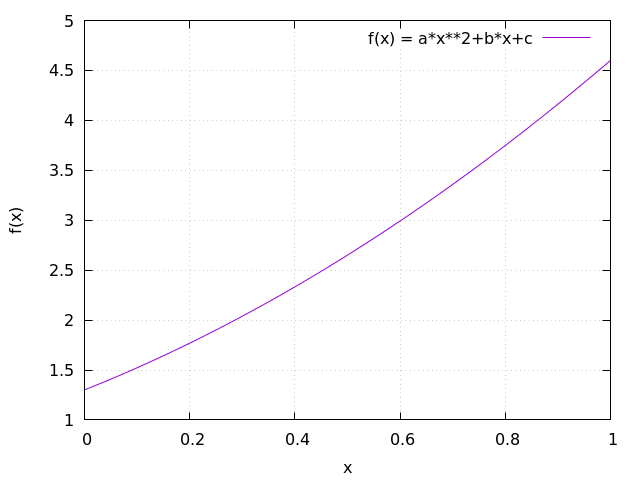
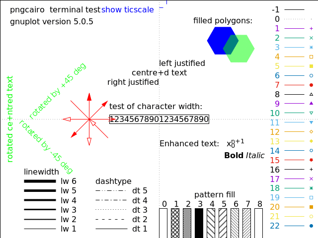
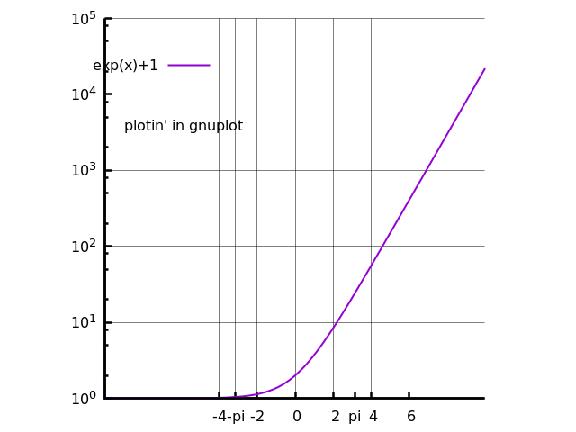
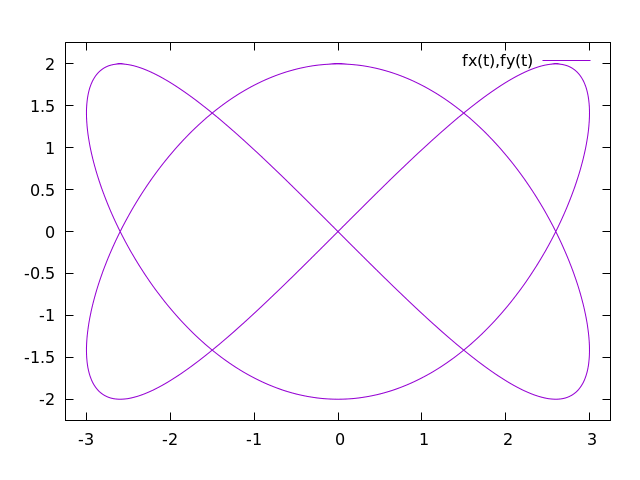
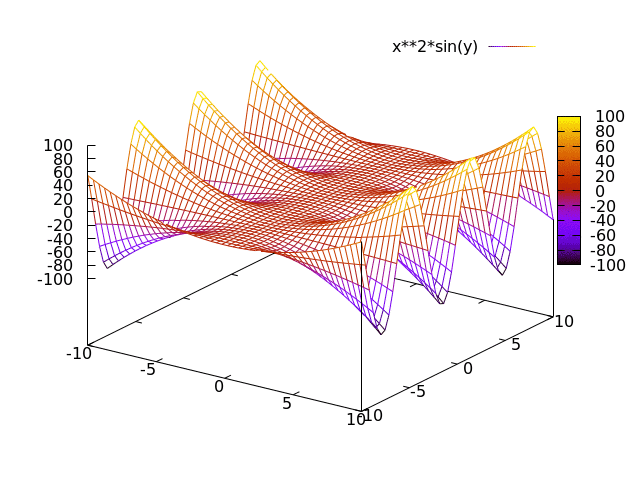

# gnuplot-lectures
gnuplot step-by-step examples

* install gnuplot: `sudo apt install gnuplot` (recommended version 5 or higher: https://sourceforge.net/projects/gnuplot/files/gnuplot/)

* plot in terminal with `gnuplot plot.plt`

# Content:

BASICS:
* basics commands

* some colors, styles, paterns and etc  ... and key settings 

* borders, tics and labels 

* paramteric plot 2d, 3d 

* 3d plots 

ADVANCED:
* some multiplots
* manipulation data from file
* statistics

